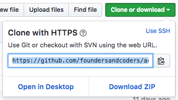

**Author**: [@njsfield](https://github.com/njsfield)  
**Maintainer**: [@njsfield](https://github.com/njsfield)

# Accessibility Morning Challenge (60 minutes)

1. Clone this repo

We are going to copy this repository to our local environment.

At the top of this page, click on the "Clone or download" button and copy the url shown here:



Then use the command in your terminal:

```
git clone https://github.com/foundersandcoders/accessibility-challenge.git
```

The git clone command copies an existing git repository, normally from some remote location to your local environment.

You should now be able to redirect into the directory just created using the command line:

```
cd accessibility-challenge
```

2. Open the index.html file
3. Using your test editor, improve as many semantic/accessibility issues littered throughout the file as you can!
4. To help you start, I'd recommend downloading [this](https://atom.io/packages/atom-beautify) useful plugin for Atom.
5. Use one of the many available accessibility checking tools available online to help you.

## Resources
- [Accessibility Tools](https://github.com/jsms90/web-accessibility/blob/master/tools-that-can-help.md)
- [Semantic Resources](https://github.com/foundersandcoders/master-reference/tree/master/coursebook/precourse#semantic-html)
